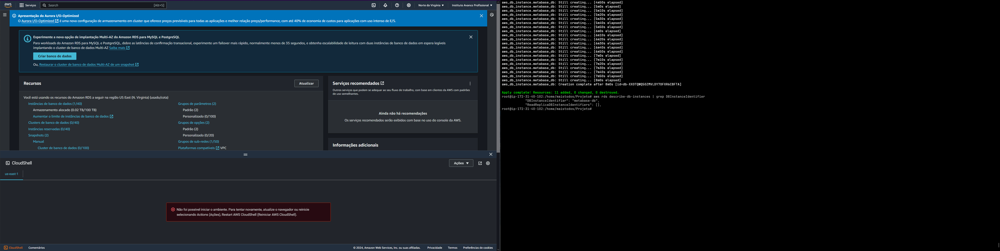

Projeto para Maistodos

Iniciei o projeto com vários outros projetos acontecendo ao mesmo tempo, mas resolvi dar uma arriscada com uma ferramenta que estou aprendendo: Terraform.

Para iniciar o projeto, criei uma maquina Debian 12 e fiz a instalação do Docker, Terraform e awscli. Comandos abaixo:

AMI ID usado: ami-058bd2d568351da34

#######################################################################################

Docker:

for pkg in docker.io docker-doc docker-compose podman-docker containerd runc; do sudo apt-get remove $pkg; done;

sudo apt-get update;

sudo apt-get install ca-certificates curl;

sudo install -m 0755 -d /etc/apt/keyrings;

sudo curl -fsSL https://download.docker.com/linux/debian/gpg -o /etc/apt/keyrings/docker.asc;

sudo chmod a+r /etc/apt/keyrings/docker.asc;

echo   "deb [arch=$(dpkg --print-architecture) signed-by=/etc/apt/keyrings/docker.asc] https://download.docker.com/linux/debian \
$(. /etc/os-release && echo "$VERSION_CODENAME") stable" |   sudo tee /etc/apt/sources.list.d/docker.list > /dev/null;

sudo apt-get update;

sudo apt-get install docker-ce docker-ce-cli containerd.io docker-buildx-plugin docker-compose-plugin;

docker --versioin;

#######################################################################################

Terrafor:

sudo apt-get update && sudo apt-get install -y gnupg software-properties-common;

wget -O- https://apt.releases.hashicorp.com/gpg | gpg --dearmor | sudo tee /usr/share/keyrings/hashicorp-archive-keyring.gpg > /dev/null;

gpg --no-default-keyring --keyring /usr/share/keyrings/hashicorp-archive-keyring.gpg --fingerprint;

echo "deb [signed-by=/usr/share/keyrings/hashicorp-archive-keyring.gpg] \
https://apt.releases.hashicorp.com $(lsb_release -cs) main" | sudo tee /etc/apt/sources.list.d/hashicorp.list;

sudo apt update;

sudo apt-get install terraform;

AWSCLI:
apt-get install awscli

#######################################################################################

Logo apos a instalação dessas aplicações, comecei a configuração das demais.

AWSCLI:
Executei o "aws configure" para configurar o acesso que criei na plataforma da AWS

Terraform:

Comecei a criação dos arquivos e diretórios, primeiro criei um usuário "maistodos" e no home dele criei uma pasta chamada projetos.
Lá fiz a criação de um arquivo chamado "main.tf" que vocês poderão encontrar no repositório acima.

Nele configurei o que foi pedido na dinâmica, um ambiente em docker com dois containers, um MetaBase e outro um banco MYSQL para conectar um no outro, os dois em redes distintas e com escalabilidade.

ERROS:
    ERRO: Estou enfrentando erros com relação ao acesso a internet pelo VPC.. tentando resolver o caso.
    Resolvido: faltava um parâmetro no arquivo.
    ERRO: O banco de dados está sendo criado, mas nao aparece na plataforma web da AWS, estou tentando descobrir o porque, mas só parece um erro da AWS ou da conta gratuita que estou usando.
    Na imagem abaixo vao conseguir ver o erro, o banco está criado como mostrado no console a direita, mas não aparece na plataforma e também está apresentando erro no CloudShell:
    

    Por conta desse erro, decidi não publicar a parte do CI/CD, pois acho que a ferramenta Terraform e AWS estão com alguma inconsistência e obtive erros ao tentar também. 

Bom time, infelizmente esse teste chega ao final para mim, fui extremamente incrível usar essa ferramenta nova para implementar esse cenário para vocês, que não pude terminar por completo por falta de tempo e os famosos erros inesperados. Mas acredito que tudo ficou bem claro e simples de entender. Se tiverem duvidas, é só entrar em contato.

Espero ver vocês nessa ou nas próximas oportunidades.
Abrações.